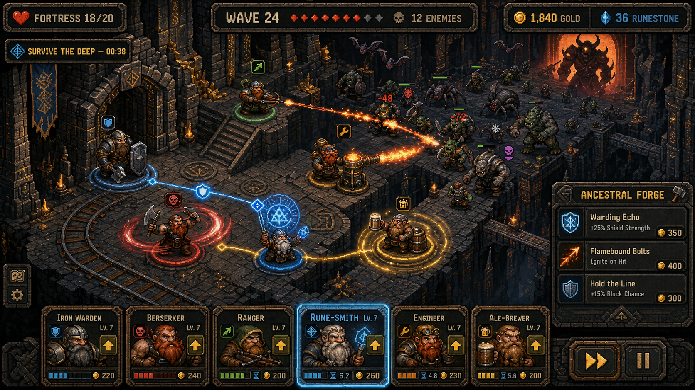

# Dwarven Depths

A pixel-art roguelite about assembling, placing, and upgrading a company of dwarves to survive relentless waves in a ruined underground kingdom.

## Core concept

- **Build a company:** unlock dwarves with distinct roles, abilities, and upgrade paths.
- **Create synergies:** combine wards, elemental effects, defensive formations, and support auras.
- **Control the battlefield:** place the company around halls, passages, stairways, bridges, and other natural chokepoints.
- **Survive the deep:** withstand escalating waves of goblins, trolls, spiders, and ancient subterranean horrors.
- **Push farther:** earn character XP and Forge Ore, improve the roster, and reach increasingly dangerous sections of the fallen kingdom.

## Current phase

The project is in **Phase 1 deterministic harness implementation**. Milestone 0 established the strict TypeScript workspace, content/scenario validation, canonical checksums, headless run bundles, and Node/Chromium/Firefox/WebKit parity. Phase 1 now includes independently verifiable replay bundles, stable immutable entity/effect tables, and verified timeline inspection; intermediate checkpoint comparison and first-divergence reporting remain before broader gameplay state.

- [Phase 1 Deterministic Replay Foundation](docs/phase-1.md)
- [Milestone 0 Implementation and Commands](docs/milestone-0.md)

- [Concept Art Direction](docs/concept-art.md)
- [Core Progression and Round Structure](docs/gameplay-loop.md)
- [First-Pass Systems and Content Decisions](docs/first-pass-systems.md)
- [Independent Design Review Synthesis](docs/design-review-synthesis.md)
- [Technical Design Readiness Rules](docs/technical-design-readiness.md)
- [Technical Design](docs/technical-design.md)
- [Simulation, Test, and Balance Harness](docs/simulation-harness.md)
- [Technical Design Review Synthesis](docs/technical-design-review-synthesis.md)
- [Technical Implementation Plan](docs/implementation-plan.md)
- [ADR-0001: TypeScript deterministic core](docs/adr/0001-typescript-deterministic-core.md)

## Working title

**Dwarven Depths** is a working title and may change as the design develops.

## License

Code and documentation are released under the [MIT License](LICENSE). Project artwork is included for concept and development purposes; see [assets/concept-art/README.md](assets/concept-art/README.md).
