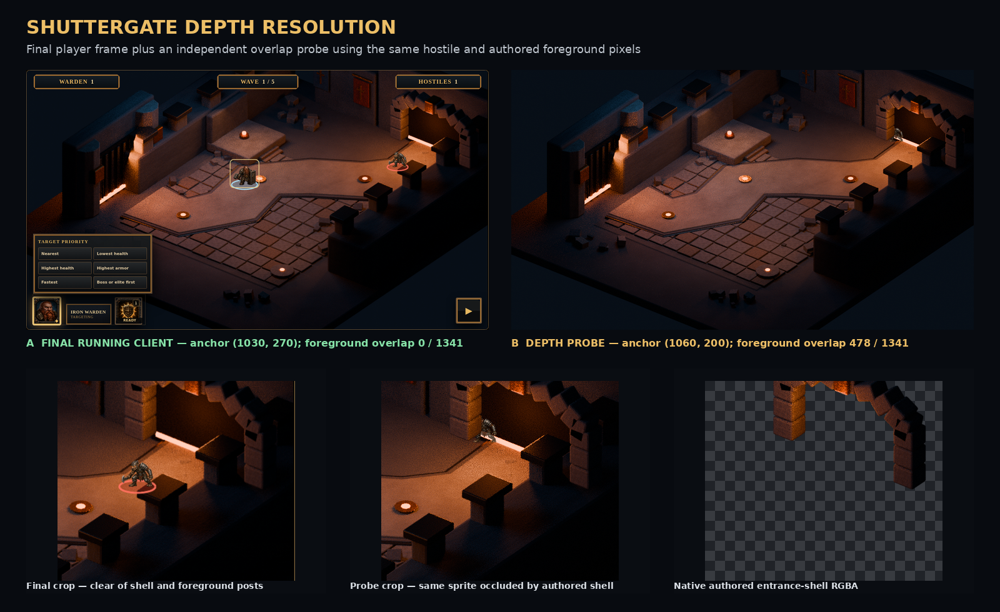

# Shuttergate running-client truth screen

This package is the reproducible product-owner review surface for issue #287. It is intentionally separate from the approved tutorial-map art package and from diagnostic evidence.

## Inline review packet

### Running-client truth screen


### Approved #284 keyframe vs current client


### Hostile / foreground depth resolution



The final hostile uses authored route coordinate `(1030,270)` and has zero sprite-alpha overlap with the entrance shell. The same decoded hostile is also evaluated at the fixed `(1060,200)` probe: its positive overlap must be occluded by the same authored foreground. This proves both the foreground-clear final relation and the functioning foreground layer rather than treating movement alone as evidence.

### Target policy, Shield Slam, resume, and pause


The animation is an inline review derivative of the committed WebM. The WebM and its hash-bound JSON sidecar remain the authoritative interaction evidence.

## Capture contract

- Browser viewport: exactly `1440×900` at device pixel ratio `1`.
- Production frame: exactly `1280×720` inside the viewport.
- Fixture: `scenarios/conformance/shuttergate-web-truth.json`.
- Authoritative snapshot: simulation tick `1`, paused in the running phase.
- Registry: exactly one 56 px Warden and one 44 px hostile.
- Layer order: environment, world rings/effects/subjects, entrance shell, screen-space focus indicator, HUD.
- Controls present and exercised by the capture script: target priority, Shield Slam, and pause/resume.
- Environment manifest: hashes only the clean plate and entrance-shell architecture; prohibited entity/effect/state/HUD roles fail capture.
- Exact runtime source head and one capture ID bind the screenshot hash, fixture, tick, viewport, registry, HUD count labels, and sprite alpha bounds.
- Runtime and capture independently decode the actual sprite/foreground alpha. A transparent-Warden mutation must fail `pnpm test:shuttergate-alpha-integrity`.
- Runtime and independent capture decoding must agree that the final hostile has zero entrance-shell overlap and that the fixed depth probe has positive overlap. The depth-resolution board shows the final frame, probe composite, and native authored RGBA isolation together.
- Player-facing pixels contain no raw entity IDs, map IDs, or simulation ticks. Those values remain in the machine-readable sidecar.

## Reproduce

Start the web client, then run:

```bash
pnpm capture:shuttergate-truth
pnpm capture:shuttergate-clip
pnpm capture:shuttergate-comparison
pnpm capture:shuttergate-depth
```

The script fails unless the viewport, exact tick, registry counts, controls, and sidecar alignment agree. It captures the paused truth screen, hashes the PNG into the sidecar, then queues a target-policy change and Shield Slam, resumes the simulation, and requires the authoritative tick to advance.

## Files

- `shuttergate-truth-screen.png`: product-owner review image.
- `shuttergate-truth-screen.json`: atomic capture sidecar, registry, layer order, control checks, and screenshot SHA-256.
- `shuttergate-interaction-clip.webm`: 8.4-second pointer/keyboard proof of target policy, Shield Slam, authoritative advancement, and pause.
- `shuttergate-interaction-clip.json`: clip hash, exact runtime source head, fixture, viewport, tick interval, and interactions.
- `shuttergate-interaction-proof.gif`: inline review derivative of the interaction clip.
- `approved-keyframe-vs-running-client.png`: equal-size comparison against the issue #284 approved keyframe.
- `shuttergate-depth-resolution.png`: final running-client frame, positive foreground-occlusion probe, and native entrance-shell RGBA isolation.
