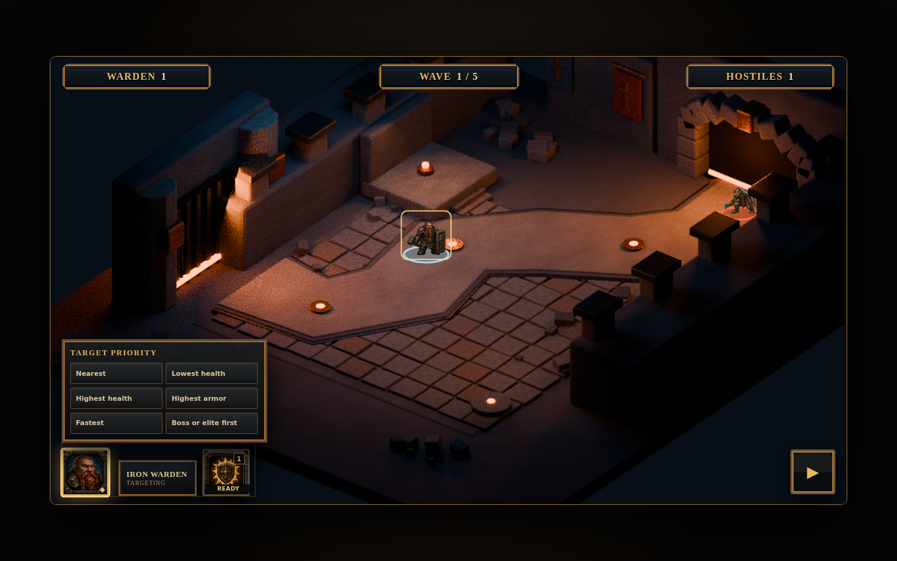
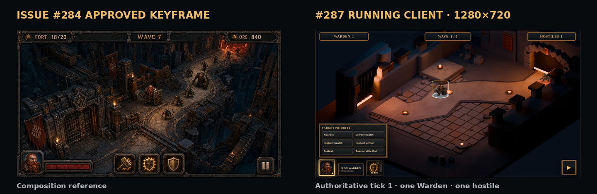

# Shuttergate running-client truth screen

This package is the reproducible product-owner review surface for issue #287. It is intentionally separate from the approved tutorial-map art package and from diagnostic evidence.

## Inline review packet

### Running-client truth screen



### Approved #284 keyframe vs current client



### Hostile / authored entrance depth

The final hostile uses the exact shared-camera projection of Blender route point `(8.0,17.0,0.39)`, producing runtime anchor `(1110,253)`. That single player-facing frame visibly exercises both sides of the authored depth split: the hostile is drawn over the native-renderer `entrance-route-rear.png` tunnel surface, while `entrance-route-foreground.png` contains every nearer shared-scene object touched by the hostile, its base ring, or its maximum transient effect footprint—including both adjacent wall members and local rubble. No alternate coordinate, diagnostic probe, or synthetic composition is used as product evidence.

### Target policy, Shield Slam, resume, and pause


The animation is an inline review derivative of the committed WebM. The WebM and its hash-bound JSON sidecar remain the authoritative interaction evidence.

## Capture contract

- Browser viewport: exactly `1440×900` at device pixel ratio `1`.
- Production frame: exactly `1280×720` inside the viewport.
- Fixture: `scenarios/conformance/shuttergate-web-truth.json`.
- Authoritative snapshot: simulation tick `1`, paused in the running phase.
- Registry: exactly one 56 px Warden and one 44 px hostile.
- Layer order: environment with rear architecture, world rings/effects/subjects, entrance shell and route-facing foreground, screen-space focus indicator, HUD.
- Controls present and exercised by the capture script: target priority, Shield Slam, and pause/resume.
- Environment manifest: hashes the clean plate, authored rear depth witness, entrance shell, and authored route-facing foreground; prohibited entity/effect/state/HUD roles fail capture.
- Exact runtime source head and one capture ID bind the screenshot hash, fixture, tick, viewport, registry, HUD count labels, and sprite alpha bounds.
- Runtime and capture independently decode the actual presented sprite/foreground alpha. Interior alpha `>=16` is normalized to fully opaque while retaining lower-alpha antialiased support; at least 80% of every subject's nonzero support must be fully opaque. Transparent-Warden and transparent-enemy mutations must both fail `pnpm test:shuttergate-alpha-integrity`.
- Runtime and independent capture decoding must agree that the final hostile overlaps both authored depth witnesses in the same frame and that the full hostile, base-ring, and maximum transient-effect footprints are clipped by the complete nearer-object pass.
- Player-facing pixels contain no raw entity IDs, map IDs, or simulation ticks. Those values remain in the machine-readable sidecar.

## Reproduce

Start the web client, then run:

```bash
pnpm capture:shuttergate-truth
pnpm capture:shuttergate-clip
pnpm capture:shuttergate-comparison
```

The script fails unless the viewport, exact tick, registry counts, controls, and sidecar alignment agree. It captures the paused truth screen, hashes the PNG into the sidecar, then queues a target-policy change and Shield Slam, resumes the simulation, and requires the authoritative tick to advance.

## Files

- `shuttergate-truth-screen.png`: product-owner review image.
- `shuttergate-truth-screen.json`: atomic capture sidecar, registry, layer order, control checks, and screenshot SHA-256.
- `shuttergate-interaction-clip.webm`: 8.4-second pointer/keyboard proof of target policy, Shield Slam, authoritative advancement, and pause.
- `shuttergate-interaction-clip.json`: clip hash, exact runtime source head, fixture, viewport, tick interval, and interactions.
- `shuttergate-interaction-proof.gif`: inline review derivative of the interaction clip.
- `approved-keyframe-vs-running-client.png`: equal-size comparison against the issue #284 approved keyframe.
